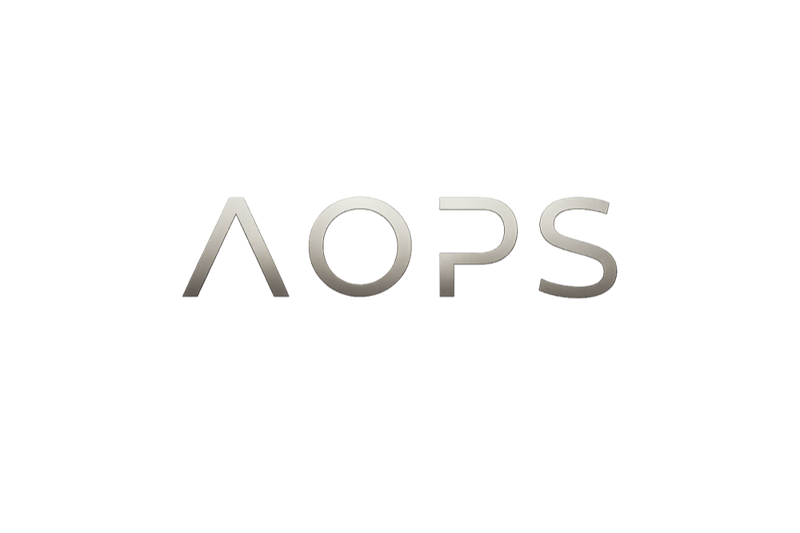
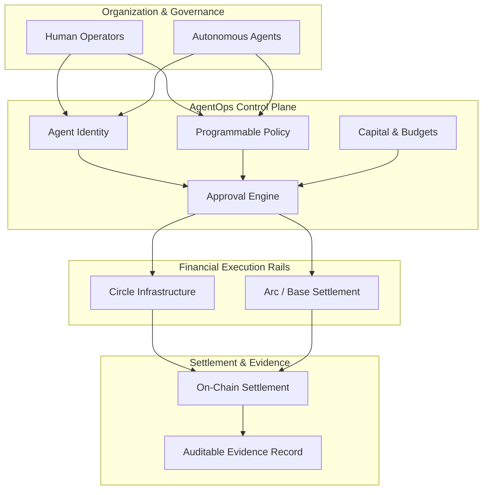
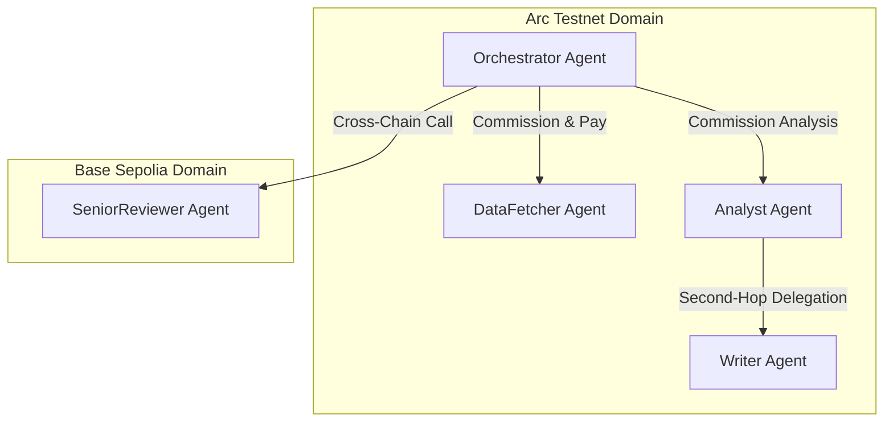
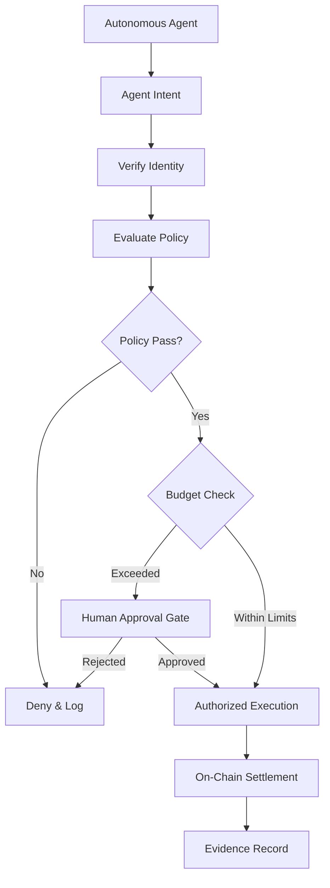
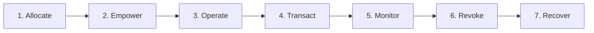

<p align="center">
  
</p>

<p align="center">
  <strong>The organizational control plane for the agentic economy.</strong>
</p>

<p align="center">
  
  &nbsp;&nbsp;&nbsp;&nbsp;
</p>

---

<p align="center">
  
</p>

**AgentOps (AOPS)** gives autonomous agents programmable economic authority. It sits between an organization's agents and the financial infrastructure they use, providing the identity, policies, budgets, approvals, payment controls, and evidence required to let agents operate as accountable economic actors.

Agents can discover services, purchase resources, hire other agents, commission work, and move programmable money — while the organization remains in control of **who can act, what they can do, how much capital they can access, which counterparties they can transact with, and when a human must intervene**.

> **Wallets provide financial capability. AgentOps provides organizational authority.**

---

## Why AgentOps

The agentic economy introduces a new class of software actor.

A traditional application executes inside boundaries defined by its developers. An autonomous agent can make decisions dynamically, invoke external services, delegate work, and initiate financial transactions on its own.

Giving that agent a wallet solves only one problem: **how it can move money**.

Organizations also need answers to:

| Control Domain | Organizational Question |
|---|---|
| **Identity** | Which agent is acting? |
| **Authority** | What has the organization delegated to it? |
| **Capital** | How much can it spend? |
| **Counterparties** | Who can it transact with? |
| **Governance** | Which actions require approval? |
| **Accountability** | What policy authorized the transaction? |
| **Evidence** | Can the organization reconstruct the decision after settlement? |

AgentOps provides that missing organizational layer.

---

## What AgentOps Does

AgentOps combines the controls required to operate an autonomous agent organization in one unified system.

### Agent Identity
Every agent operates as an explicit organizational identity with its own role, credentials, wallet, policy bindings, and economic boundaries.

### Programmable Policies
Organizations define what agents are allowed to do before they begin operating. Policies can govern actions, counterparties, destinations, payment access, spending limits, and approval requirements.

The system is designed around a **fail-closed** model: actions without an applicable authorization are not permitted.

### Budgets & Capital Controls
Organizations can assign capital to individual agents, establish per-request limits and period budgets, and constrain where that capital can move. The agent's wallet provides the final hard financial boundary.

### Human Approvals
Not every action should be fully autonomous. AgentOps can escalate operations that exceed configured thresholds or require organizational approval. The approval becomes part of the governed execution path rather than an independent UI confirmation.

### Agent-to-Agent Commerce
Agents can hire and pay other agents under organizational policy.

AgentOps supports bounded intra-fleet payments using Permit2 and demonstrates autonomous second-hop delegation, where an agent can hire another agent using its own identity and economic authority.

### External Payments
AgentOps connects agent activity to Circle's payment infrastructure and x402/Gateway for machine-to-service commerce.

The control plane governs the decision and authority; the underlying financial infrastructure provides the payment rails.

### Escrow & Trust
For new or lower-trust relationships, AgentOps supports ERC-8183 escrow before moving toward more efficient standing payment relationships.

Completed interactions can feed into ERC-8004 identity and reputation, creating a path from guarded first interaction to established economic relationships.

### Cross-Chain Execution
Agent economic activity can span Arc and Base.

Cross-chain actions can remain subject to the same organizational policies and approval boundaries, including approval-gated execution before settlement on another network.

### Evidence Lifecycle
AgentOps connects the lifecycle of a governed action:

$$\text{Intent} \longrightarrow \text{Identity} \longrightarrow \text{Policy} \longrightarrow \text{Budget} \longrightarrow \text{Approval} \longrightarrow \text{Execution} \longrightarrow \text{Settlement} \longrightarrow \text{Evidence}$$

The resulting record provides the organizational context behind a financial transaction, rather than treating the blockchain transaction as an isolated event.

---

## The AgentOps Model



AgentOps is intentionally an organizational layer rather than another wallet or payment SDK. Circle provides the financial infrastructure; AgentOps governs the authority under which autonomous software can use it.

---

## Demonstrated Agent Organization

The project was validated through a five-agent research organization operating across **Arc Testnet** and **Base Sepolia**:



### Agent Roles

| Agent | Role & Responsibility |
|---|---|
| **Orchestrator** | Coordinates the organization and commissions work |
| **DataFetcher** | Provides data acquisition capabilities |
| **Analyst** | Performs analysis and can exercise bounded second-hop delegation |
| **Writer** | Synthesizes completed work |
| **SeniorReviewer** | Provides review capability on Base |

Each agent has an independent identity and wallet.

### Demonstrated Capabilities

- Governed agent-to-agent payments
- Per-agent spending authority
- Policy-controlled hiring
- Second-hop delegation
- Permit2 settlement
- ERC-8183 escrow
- ERC-8004 identity and reputation
- Approval-gated cross-chain execution
- Capital revocation and recovery
- MCP-based agent interaction
- End-to-end evidence linking agent intent to blockchain settlement

---

## Economic Rails

AgentOps uses different settlement mechanisms according to the relationship being governed.

| Relationship | Rail | Purpose |
|---|---|---|
| **External Commerce** | **x402 / Circle Gateway** | Machine-to-service payments |
| **Established Agent Relationships** | **Permit2** | Bounded delegated agent-to-agent spending |
| **New / Lower-Trust Relationships** | **ERC-8183** | Guarded escrow for first interactions |
| **Reputation** | **ERC-8004** | Identity and reputation after completed interactions |

This creates a progression from guarded first interactions toward more efficient delegated spending as trust and organizational relationships develop.

---

## Governed Execution

A typical economic action follows the same control path regardless of the specific payment rail:



This makes governance part of execution itself.

---

## Built on Circle and Arc

AgentOps is designed around the emerging stablecoin-native agent economy.

- **Circle** provides the underlying programmable financial infrastructure, including Developer-Controlled Wallets, Gateway, and x402.
- **Arc** provides the settlement environment in which the demonstrated agent economy operates.

AgentOps adds the organizational control layer around these primitives: identity, authority, policy, budgets, approvals, delegation, and evidence.

> **Circle provides financial rails. AgentOps governs how autonomous organizations use them.**

---

## MCP for Autonomous Agents

AgentOps exposes its capabilities through a hosted MCP interface so agents can interact with the same governed control plane used by human operators.

An agent can authenticate, discover available capabilities, request economic actions, and operate under the policies and authority assigned to its identity.

This makes AgentOps usable as infrastructure for autonomous agents rather than requiring every agent application to implement its own payment governance layer.

---

## Capital Lifecycle

Economic authority is treated as a lifecycle rather than a permanent wallet assignment.



An organization can allocate working capital to an agent, establish its operating boundaries, monitor its activity, revoke its authority, and recover remaining funds when that agent should no longer control capital.

---

# PMOA Submission History

AgentOps was developed through three PMOA submission checkpoints. Each checkpoint represents a meaningful stage of the product.

### Checkpoint 1 — Project, Team & Idea
**Deadline:** Sunday, 19 July 2026

The first checkpoint established the project direction.

We submitted the initial **AOPS / AgentOps concept**: an organizational control plane for autonomous agents operating in an emerging programmable-money economy.

The focus was the core product thesis:
- Agents should have explicit organizational identities.
- Economic authority should be policy-controlled rather than equivalent to wallet ownership.
- Organizations should be able to define budgets, permissions, and approval requirements.
- Agent activity should be auditable from intent through settlement.
- Circle's financial infrastructure and Arc could provide the underlying payment and settlement layer.

This checkpoint established the product idea that became the foundation for the implementation.

---

### Checkpoint 2 — Mid-Submission
**Deadline:** Sunday, 2 August 2026

Checkpoint 2 represented the first substantial working implementation.

By this stage, AgentOps had progressed from the initial concept into a functional **MCP HTTP and Circle payment-infrastructure implementation**. The Circle Gateway ecosystem and agent-facing payment path were substantially built, and the hosted MCP experience had become the primary interface for autonomous agents.

The remaining work was the expansion from that foundation into the full Arc-native agent economy demonstrated in the final submission. Major capabilities developed during this phase included:
- Arc integration and settlement
- Full multi-agent fleet execution
- Agent-to-agent commerce
- Agent hiring and delegation
- Second-hop agent interactions
- Invite / wire-token based agent onboarding
- Native AI-assisted fleet creation and organization setup
- The broader Permit2 and escrow economic model
- Cross-chain execution with approval governance
- Complete evidence and capital lifecycle flows

Checkpoint 2 therefore marked the transition from **a governed MCP and payment-control foundation** into the broader autonomous economic organization delivered at final submission.

---

### Checkpoint 3 — Final Submission
**Deadline:** Sunday, 9 August 2026

The final checkpoint completed the product and brought the remaining pieces together into a functional AgentOps MVP deployed across **Arc Testnet and Base Sepolia**.

The final implementation demonstrated:
- A five-agent autonomous research organization
- Independent agent identities and wallets
- Organizational policy enforcement
- Per-agent budgets and capital limits
- Agent-to-agent payments through Permit2
- Second-hop autonomous delegation
- ERC-8183 escrow for lower-trust relationships
- ERC-8004 identity and reputation
- Approval-gated cross-chain execution
- Circle-backed financial execution
- Hosted MCP for autonomous agents
- Human operator controls
- Capital revocation and recovery
- Evidence connecting agent intent, policy, approval, execution, and on-chain settlement

The final submission evolved the original idea from an organizational control-plane concept into a demonstrated economic operating layer for autonomous agents.

---

## Repository Structure

```text
AOPS-PMOA/
├── apps/
│   ├── web/                 # AgentOps operator experience
│   ├── api/                 # Control plane and governance API
│   └── mcp/                 # Hosted MCP interface
│
├── packages/
│   ├── contracts/           # Shared contracts and interfaces
│   ├── config/              # Shared configuration
│   ├── db/                  # Database layer
│   ├── runtime-client/      # Runtime API client
│   └── onchain/             # On-chain integrations
│
├── templates/               # Agent integration templates
├── demo/                    # Demonstration assets
├── docs/                    # Product and technical reference
│
├── PRODUCT.md
├── CONTRIBUTING.md
├── SECURITY.md
└── LICENSE
```

The repository contains the implementation and supporting product and technical reference material. The primary README is intentionally focused on the product, its capabilities, demonstrated architecture, and submission history rather than internal development journals or temporary engineering notes.

---

## Project Status

**Functional testnet MVP**

AgentOps has been demonstrated on **Arc Testnet** and **Base Sepolia** with live agent wallets, governed agent-to-agent transactions, escrow, approval-gated cross-chain execution, MCP interaction, and on-chain settlement evidence.

The current implementation is a testnet product and should not be interpreted as a production mainnet payment service.

---

## License

AgentOps is not be copied, redesigned or republished outside the official work in any way or form.
