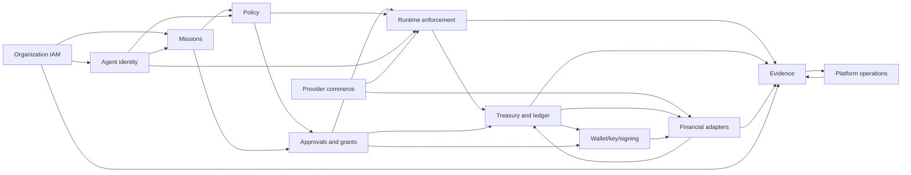

# Dependency and Ownership Map

[[10-Projects/Web3-Builds/agentOps/BUILD-PMOA/docs/mainnet-planning/README|Mainnet planning index]] | [[10-Projects/Web3-Builds/agentOps/BUILD-PMOA/docs/mainnet-planning/02-canonical-kernel|Canonical kernel]] | [[10-Projects/Web3-Builds/agentOps/creative-free/architecture/target-architecture|Prior target diagrams]]

## Dependency rule

Each canonical record has one owner. Consumers may cache projections but cannot mutate the source record. Cross-domain workflows use commands, versioned events, and reconciliation rather than shared unowned state.

## Domain ownership

| Domain | Canonical writes | Consumes |
|---|---|---|
| Organization IAM | organizations, humans, memberships, roles, sessions | evidence, incidents |
| Agent identity | agents, workload identities, credentials, delegations, connections | organization membership, missions, policy |
| Mandates and missions | mission versions, assignments, completion criteria | humans, agents, budgets, providers |
| Policy and authority | policy versions, bindings, decisions, policy epochs | identities, missions, reservations, provider offers |
| Approvals and grants | approval requests, approvals, grants, emergency epochs | decisions, identities, action intents |
| Runtime enforcement | action intents, runtime attempts, mediated results | identity, mission, decision, grant, provider/tool metadata |
| Provider commerce | providers, services, offers, destinations, deliveries, disputes | identity, adapter capabilities, evidence |
| Treasury and ledger | budgets, accounts, reservations, postings, reconciliation cases | mission, decision, grant, adapter outcomes |
| Wallet/key/signing | wallet bindings, key references, signer policies, signing receipts | grant, reservation, adapter canonical intent |
| Financial execution | adapter profiles, payment attempts, external outcomes | provider offers, reservation, signer receipt |
| Evidence and privacy | evidence events, bundles, retention, legal hold, deletion cases | events from every domain |
| Platform operations | releases, deployments, incidents, SLOs, recovery exercises | health and evidence from every domain |

## Dependency graph

The two-way edges between adapter and ledger and between evidence and operations are controlled feedback:

- Adapters report authoritative outcomes; ledger alone decides postings.
- Evidence reports missing or corrupt proof; operations alone declares and resolves incidents.

Neither edge grants shared ownership.

## Required interface boundaries

| Interface | Producer | Consumer | Critical invariant |
|---|---|---|---|
| Authenticated principal | IAM/agent identity | every domain | Tenant and actor cannot be caller-selected |
| Effective mission snapshot | Missions | policy/runtime | Immutable version and expiry |
| Policy decision | Policy | approvals/runtime/ledger | Exact action hash and policy epoch |
| Execution grant | Approvals | runtime/ledger/signer | One-time, short-lived, action-bound |
| Reservation receipt | Ledger | runtime/execution | Held before external submission |
| Canonical signing intent | Execution | signer | Destination, amount, network, call data, grant, reservation |
| Signing receipt | Signer | execution/evidence | Key ID, policy, request hash, signature, attestation |
| External outcome | Adapter | ledger/provider/evidence | Provider identity and authoritative lookup |
| Journal entry | Ledger | reconciliation/evidence | Balanced and immutable |
| Delivery result | Provider commerce | runtime/evidence | Distinct from payment settlement |
| Evidence completeness | Evidence | operations/certification | Missing proof blocks or revokes release |

## Dependency invalidation

| Changed concern | Automatically invalidates |
|---|---|
| Identity or delegation semantics | mission, policy, approvals, runtime, evidence, all affected certificates |
| Mission schema | policy, approval, runtime, provider, ledger, evidence |
| Policy schema/evaluator | approvals, runtime, ledger, signer, adapter, Core gate result and dependent release certificates |
| Grant binding | runtime, ledger, signer, adapter |
| Reservation or ledger schema | signer, adapter, reconciliation, evidence, Core gate result and dependent release certificates |
| Signer/KMS/custody | financial execution-profile gate results and release certificates using that profile |
| Provider destination or offer | active grants, adapter canary, provider certificate |
| Provider API or webhook | adapter conformance, execution-profile gate result, and dependent release certificates |
| Network/chain/asset/contract | execution-profile gate result, dependent release certificates, and mainnet enablement |
| Evidence schema/retention | domain proof, market eligibility results, and dependent release certificates |
| Deployment/restore model | Core gate result and dependent release certificates |

## Authoring order

1. Corpus governance and product boundary.
2. Canonical kernel, interfaces, trust model, and current gap register.
3. Identity and mission domains.
4. Policy, approvals, and runtime.
5. Provider commerce, treasury, signing, and adapters.
6. Evidence/privacy and platform operations.
7. Cross-domain journeys.
8. Assurance profiles and release certification.
9. Roadmap and requirement index.

This order permits later documents to reference stable earlier definitions without copying them.
